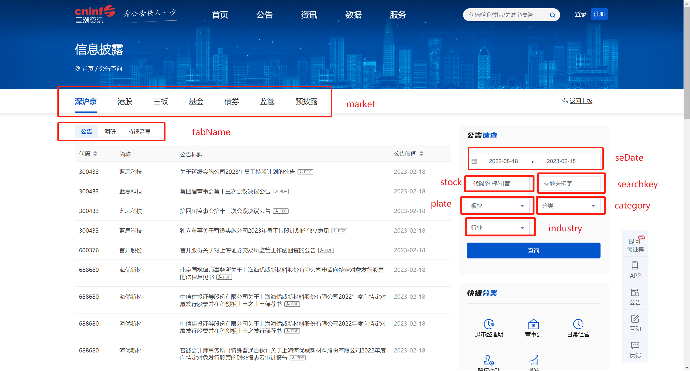

# CnInfoReports

## 特别提醒

代码日前进行了重构，可下载A股港股所有公告分类，使用时需要自己构造 filter 字典指明公告查询条件，字典含义详见 [http://www.cninfo.com.cn/new/js/app/disclosure/notice/history-notice.js?v=20220902012750](http://www.cninfo.com.cn/new/js/app/disclosure/notice/history-notice.js?v=20220902012750)

## 功能

从[巨潮资讯网](http://www.cninfo.com.cn/)根据条件查询和下载A股和港股公司公告

## 使用

- 依赖 httpx 库，主要代码是 [CnInfoReports.py](CnInfoReports.py) 中定义的 CnInfoReports 类，可以作为库导入或者直接修改该文件运行

- 初始化 CnInfoReports 的实例时，可选传入2个参数：max_threads，为最高线程数，默认值为5；skip_download_stock_json，是否跳过下载 stock json 数据，默认为 False，即下载最新的数据，如果不是新上市的 stock 或用于测试，可设置为 True，使用 [stocks.json](stocks.json) 的现成数据，节省时间

- 调用 CnInfoReports.query_announcements_info 函数时，需要传入一个字典指明公告查询条件和一个布尔值确定是否下载 PDF，字典来源详见 [http://www.cninfo.com.cn/new/js/app/disclosure/notice/history-notice.js?v=20220902012750](http://www.cninfo.com.cn/new/js/app/disclosure/notice/history-notice.js?v=20220902012750)（使用前请务必点进去看下），字段名称见下图

- 下载的报告在本级 data 文件夹下，按照证券代码分类

## Roadmap

- [x] 使用多线程
- [x] 使用 logging 代替 print 输出日志
- [x] 使用 requests 的替代品 （httpx）
- [x] 更好处理撤回和更新的定期报告
- [x] 可下载A股港股所有公告分类

## 鸣谢

[xfeng2020/cninf_reports](https://github.com/xfeng2020/cninf_reports)
